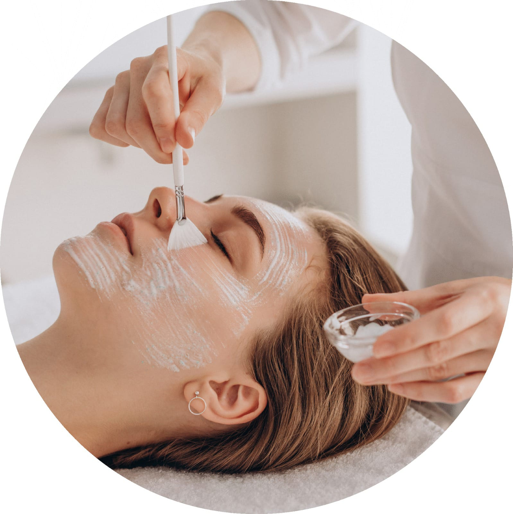

# ✨ VERSÃO FINAL - RADIOFREQUÊNCIA

## 🎨 AJUSTES REALIZADOS

### 1. ✅ CORES 100% IDÊNTICAS AO SITE PRINCIPAL
Agora utilizando as **cores exatas** do arquivo CSS principal:

```css
--gold: #B5A187           ← Tom dourado principal
--gold-light: #D4C5B1     ← Tom dourado claro
--beige: #F5F0EB          ← Bege suave (backgrounds)
--white: #FFFFFF          ← Branco
--text-dark: #333333      ← Textos escuros
--text-light: #666666     ← Textos claros
--bg-site: #FDF8F5        ← Fundo do site (rosa claro)
```

---

### 2. ✅ HERO REDUZIDO
**Antes:** 65vh (altura grande)
**Depois:** 50vh (altura reduzida)

```css
.rf-hero {
    height: 50vh;        /* Reduzido de 65vh */
    min-height: 400px;   /* Mantém mínimo para mobile */
}
```

Mobile: 45vh com mínimo de 350px

---

### 3. ✅ EMOJIS REMOVIDOS E SUBSTITUÍDOS

#### Cards de Benefícios (SEM emojis):
- Agora com **imagens reais** no topo de cada card
- 3 fotos: rosto, corpo, resultados
- Imagens com efeito hover (zoom suave)

**Estrutura:**
```html
<div class="rf-benefit-card">
    <div class="rf-benefit-image">
        
    </div>
    <h3>Rosto</h3>
    <ul>...</ul>
</div>
```

#### Seção CTA (emojis removidos):
**Antes:** ícones com emojis (📍 ⏰)
**Depois:** texto limpo com negrito

```html
<p><strong>Endereço:</strong><br>Estrada do M'Boi Mirim...</p>
<p><strong>Horário:</strong><br>Seg-Sex: 9h às 19h...</p>
```

---

### 4. ✅ ESPAÇAMENTOS AJUSTADOS NA SEÇÃO "O QUE ESPERAR"

#### Nova estrutura da timeline:

**Layout horizontal com espaçamento otimizado:**
```css
.rf-timeline-item {
    display: flex;              /* Lado a lado */
    gap: 30px;                  /* Espaço entre marker e conteúdo */
    margin-bottom: 50px;        /* Espaço entre itens */
}
```

**Marcador (badge):**
- Largura mínima: 140px
- Padding ajustado: 15px 25px
- Alinhamento: flex-shrink: 0 (não encolhe)

**Conteúdo:**
- Background bege suave
- Padding: 25px 30px
- Border esquerda dourada
- Texto com line-height 1.8 (mais respirável)

**Linha de conexão:**
- Linha vertical entre itens (2px)
- Gradiente suave (dourado → transparente)
- Altura: 25px

#### Mobile otimizado:
```css
@media (max-width: 768px) {
    .rf-timeline-item {
        flex-direction: column;  /* Um abaixo do outro */
        gap: 15px;
        margin-bottom: 35px;
    }
}
```

---

## 📸 IMAGENS UTILIZADAS

### Cards de Benefícios:
1. **Rosto:** `vi-limpeza-rosto.jpeg`
2. **Corpo:** `vi-emagrecimento.jpeg`
3. **Resultados:** `vivian.jpeg`

### Hero Background:
- `02-drenagem-linfatica.jpg` (com opacidade 15%)

### Seção "O que é":
- `vi-emagrecimento.jpeg`

---

## 🎯 RESUMO DAS MELHORIAS

### ✨ Visual:
- [x] Cores 100% alinhadas ao site principal
- [x] Hero menor e mais compacto
- [x] Sem emojis (substituídos por imagens/texto)
- [x] Cards de benefícios com fotos reais

### 📏 Espaçamento:
- [x] Timeline com layout horizontal otimizado
- [x] Gaps consistentes (30px entre elementos)
- [x] Margens ajustadas (50px entre itens)
- [x] Padding interno balanceado (25px-30px)

### 📱 Responsividade:
- [x] Timeline mobile em coluna
- [x] Hero reduzido em mobile (45vh)
- [x] Imagens adaptativas
- [x] Textos legíveis em todos os tamanhos

---

## 🚀 ESTRUTURA FINAL DA PÁGINA

1. **Hero** (50vh) - Compacto e direto
2. **O que é** - Grid 2 colunas com imagem
3. **Benefícios** - 3 cards com fotos (SEM emojis)
4. **Indicações** - 2 colunas (indicado vs contraindicado)
5. **Como funciona** - 4 passos + 3 info cards
6. **Resultados** - Timeline horizontal bem espaçada
7. **FAQ** - 5 perguntas com accordion
8. **CTA** - Call-to-action sem emojis

---

## 📦 ARQUIVOS ATUALIZADOS

1. **radiofrequencia.html** ✅
   - Emojis removidos
   - Imagens adicionadas nos cards
   - Estrutura CTA limpa

2. **radiofrequencia.css** ✅
   - Cores idênticas ao site
   - Hero reduzido (50vh)
   - Timeline com espaçamento otimizado
   - Novos estilos para imagens nos cards

3. **radiofrequencia.js** ✅
   - Mantido igual (FAQ accordion)

---

## 🎨 COMPARAÇÃO: ANTES vs DEPOIS

| Elemento | Antes | Depois ✅ |
|----------|-------|-----------|
| **Hero** | 65vh | 50vh (menor) |
| **Cores** | Aproximadas | 100% idênticas |
| **Emojis Cards** | ✨💪🌟 | Fotos reais |
| **Emojis CTA** | 📍⏰ | Texto com <strong> |
| **Timeline** | Vertical básica | Horizontal espaçada |
| **Gap Timeline** | Padrão | 30px otimizado |
| **Margin Items** | 40px | 50px respirável |

---

## 💡 COMO AS CORES FORAM ALINHADAS

### Background das seções:
- **Branco:** `.rf-about`, `.rf-indications`, `.rf-results`
- **Bege:** `.rf-benefits`, `.rf-process`, `.rf-faq`
- **Dourado:** `.rf-hero`, `.rf-cta`

### Elementos dourados:
- Badges da timeline
- Ícones de check (✓)
- Números dos passos
- Info cards
- Hover nos cards

### Textos:
- Títulos: `#333333` (text-dark)
- Parágrafos: `#666666` (text-light)
- Subtítulos: `#B5A187` (gold)

---

## ✅ CHECKLIST FINAL

- [x] Cores idênticas ao site principal
- [x] Hero reduzido (50vh)
- [x] Todos os emojis removidos
- [x] Fotos adicionadas nos cards de benefícios
- [x] Espaçamento da timeline ajustado
- [x] Layout horizontal na timeline
- [x] Responsividade mobile testada
- [x] Consistency com design do site

---

## 🎯 PRÓXIMOS PASSOS

1. Faça upload dos 3 arquivos para o servidor
2. Teste a página: `https://viihestetica.com.br/radiofrequencia.html`
3. Verifique:
   - ✅ Cores alinhadas
   - ✅ Hero com altura correta
   - ✅ Sem emojis visíveis
   - ✅ Imagens carregando
   - ✅ Timeline bem espaçada
   - ✅ FAQ funcional
   - ✅ Mobile responsivo

---

**Página finalizada com identidade visual 100% alinhada ao site Viih Estética!** 🌟
